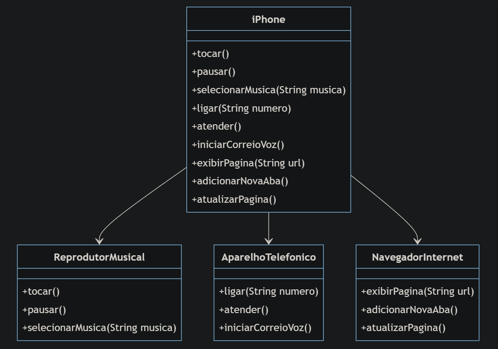

# Modelagem e Diagramação de um Componente iPhone

### Reprodutor Musical
- Métodos: 
  - `tocar()`
  - `pausar()`
  - `selecionarMusica(String musica)`

### Aparelho Telefônico
- Métodos:
  - `ligar(String numero)`
  - `atender()`
  - `iniciarCorreioVoz()`

### Navegador na Internet
- Métodos:
  - `exibirPagina(String url)`
  - `adicionarNovaAba()`
  - `atualizarPagina()`

## Objetivo
- Criar um diagrama UML que represente as funcionalidades descritas acima.
- Implementar as classes e interfaces correspondentes em Java (Opcional).

## Diagrama UML
